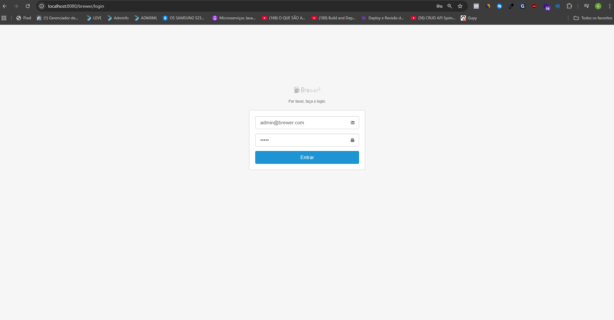
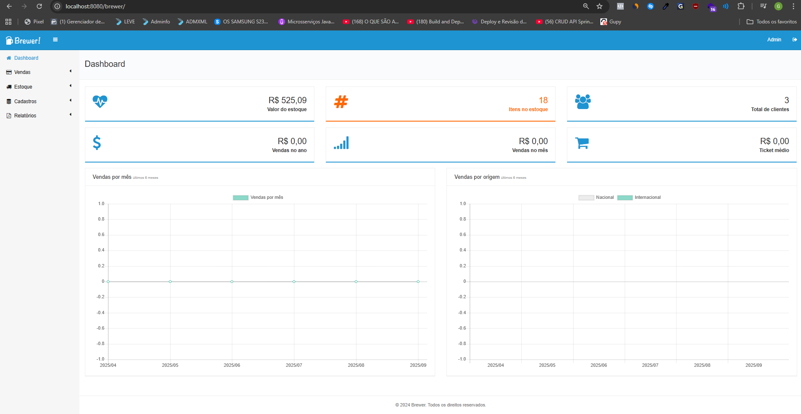
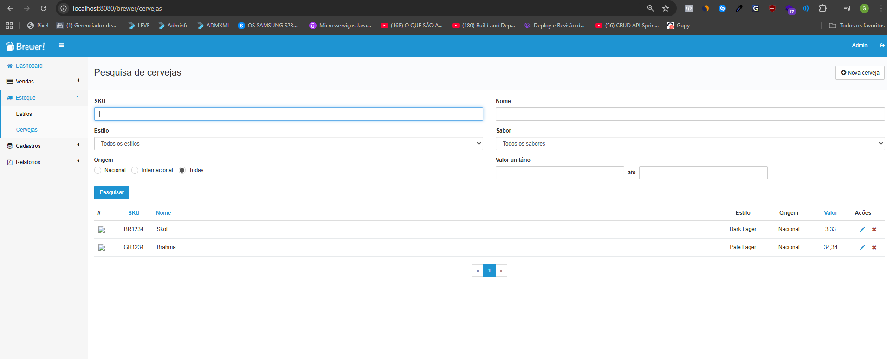
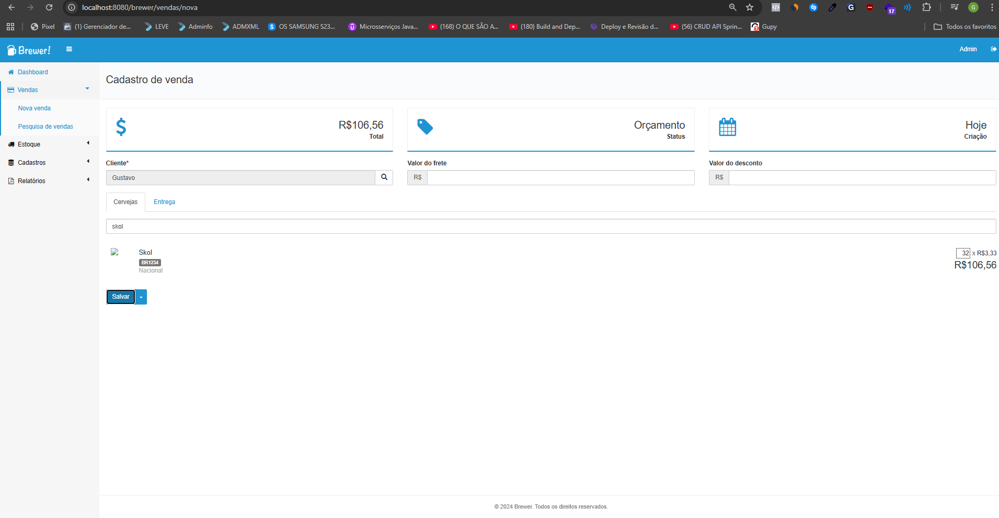
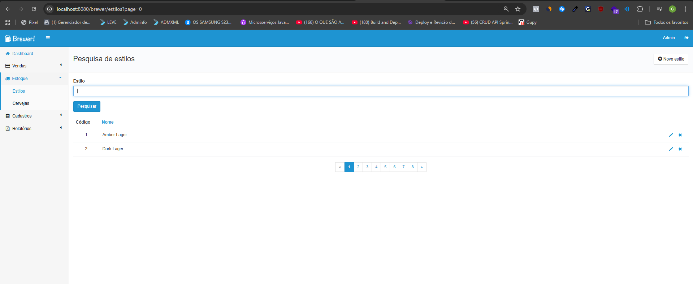
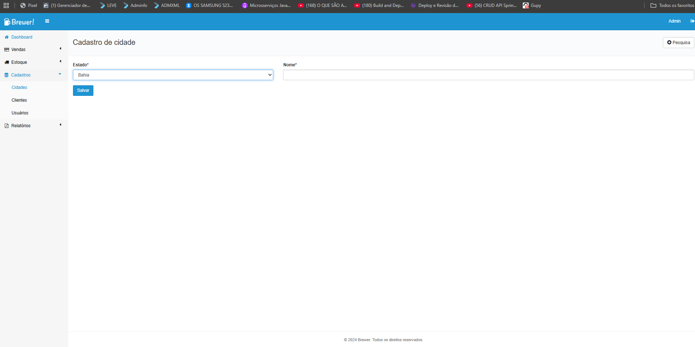
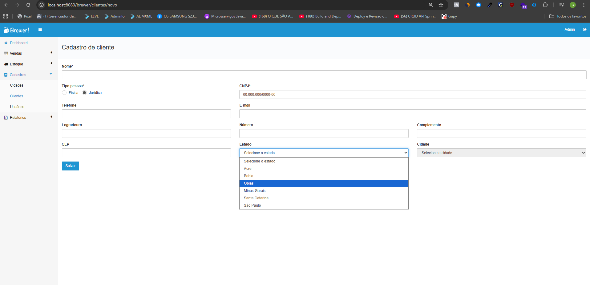
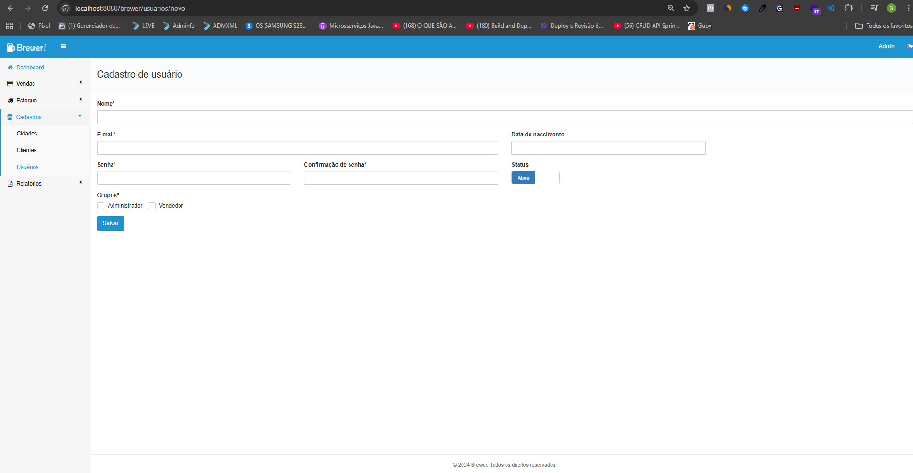
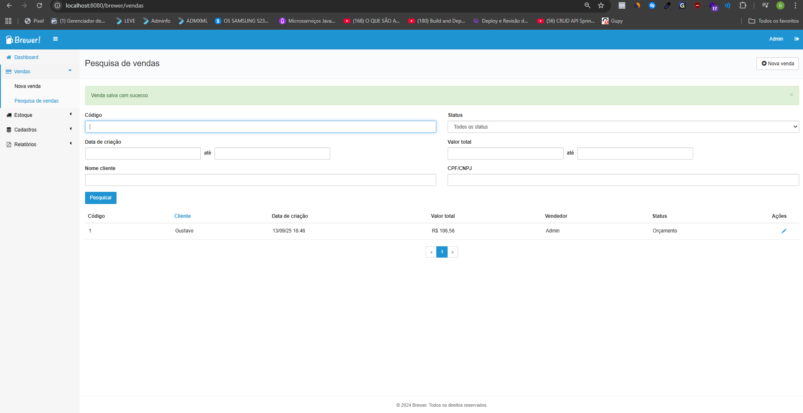

## Title

✂️ Brewer

## Description

🚀Web system to manage the sale of beers, allowing users to browse the catalog, add products to the cart, place orders, and for administrators to manage stock, orders, and products.

##

<h1 align="center">
  
  
  
  
  
  
  
  
  
</h1>

# Table of Contents

  <a href="#recycle-about-the-project">About the project</a>&nbsp;&nbsp;&nbsp;|&nbsp;&nbsp;&nbsp;
  <a href="#-technologies">Technologies</a>&nbsp;&nbsp;&nbsp;|&nbsp;&nbsp;&nbsp;
  <a href="#-getting-started">Getting Started</a>&nbsp;&nbsp;&nbsp;|&nbsp;&nbsp;&nbsp;
  <a href="#-features">Features</a>&nbsp;&nbsp;&nbsp;|&nbsp;&nbsp;
 

## 🚀 Technologies

**🛠 Language / Main Framework**

- Java Spring Boot – Framework for building web applications and REST APIs  

**🔑 Security / Authentication**

- Spring Security – Authentication and authorization framework  

**💾 Database / ORM**

- MySQL – Relational database management system  
- Hibernate – ORM for databases  

**🎨 View / Frontend**

- Thymeleaf – Java template engine  
- HTML – Markup language for web pages  
- CSS – Styling language for web pages  
- jQuery – JavaScript library for DOM manipulation  
- AJAX – Asynchronous requests for dynamic web pages  

## 🔗 Features

- Add customer  
- Add user  
- Add sale  
- Add photo to beer  
- Add city  
- Generate report with Jasper

  ## Getting Started

  This project runs on **Apache Tomcat** (embedded with Spring Boot by default).

